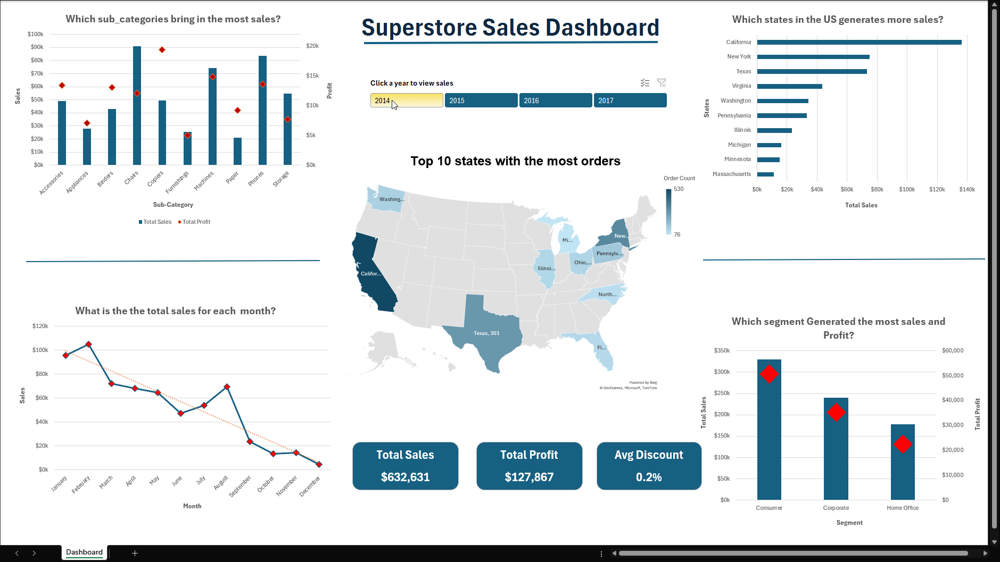

# Superstore-sales-forecast-analysis
Excel Power Query and Power Pivot project analyzing and forecasting Superstore sales.

This Excel project demonstrates a full data analysis workflow using **Power Query**, **Power Pivot**, and **DAX** — from data cleaning to forecasting and visualization.

---

## 📊 Project Overview
- Cleaned and transformed raw sales data in Power Query.
- Built a Calendar Date table, Created relationships between tables, and created measures in Power Pivot.
- Built a dynamic Excel dashboard with slicers, KPIs, heatmaps, and sparklines.
- Peformed Sales Forecast using Excel Forecast Sheet.

---

## 🧠 Key Insights
- Sales show strong seasonal spikes in Q1 and Q3.
- Forecast predicts gradual sales growth through early 2018.
- Chairs and Machines are the top-selling categories.

---

## 🛠️ Tools Used
- Microsoft Excel  
- Power Query  
- Power Pivot  
- DAX  
- Pivot Tables & Charts
- What-if Analysis (Forcast Sheet)
